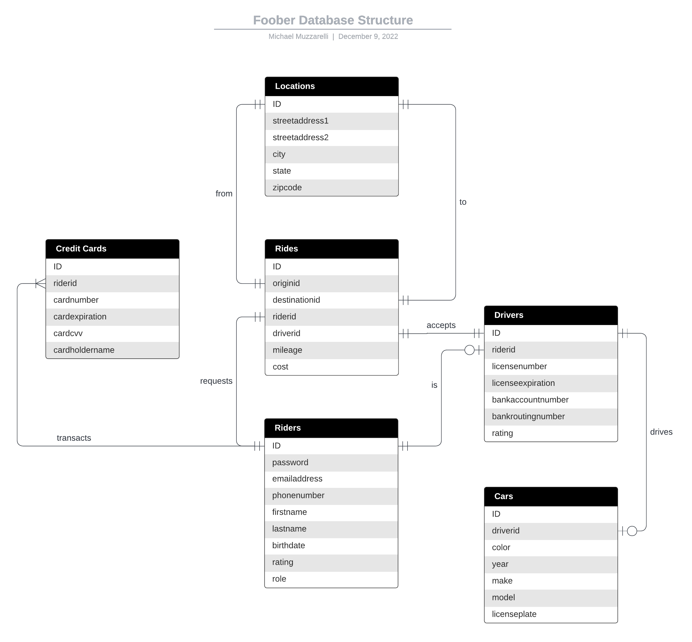

# Database Structure

The Foober database structure is simplistic in nature and is represented as such:

A customer or **rider** must register with an email address and password and create a profile to include their name, birthdate, phone number, and rider rating, and are automatically assigned a role of rider. Riders are able to authorize **credit cards** to pay for services on the platform. Riders are also able to register as a **driver** with the same email address and password and provide license credentials and a bank account to be paid in. Drivers are able to register a **car** and provide the year, make, model, and license plate number. Riders can request **rides** which require both a source and destination **location**. Rides track the rider, driver, source, and destination, as well as the mileage and cost. Locations indicate the street address, city, state, and zip code.